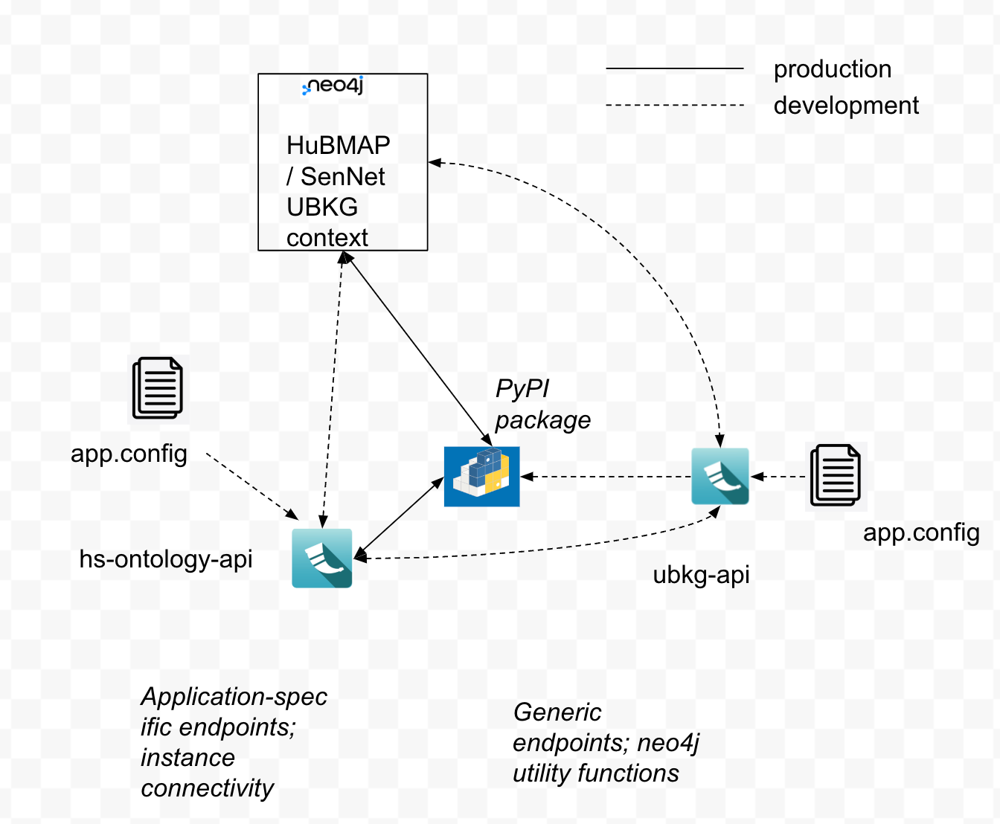

# Ontology API for HuBMAP and SenNet applications

Like [ubkg-api](https://github.com/x-atlas-consortia/ubkg-api), the hs-ontology-api is a Flask web application with 
Blueprint extensions that provides a REST API for parameterized queries against an 
instance of a [UBKG](https://ubkg.docs.xconsortia.org/) neo4j instance. 
The hs-ontology-api is specific to the [HuBMAP/SenNet context](https://ubkg.docs.xconsortia.org/contexts/#hubmapsennet-context) 
of UBKG: it manages endpoints that assume that the UBKG instance includes content ingested
from SABs related to HuBMAP and SenNet. The UBKG-api contains code that is 
common to all UBKG contexts.

By default, hs-ontology-api imports the ubkg-api that has been compiled 
as a PyPi package. 



# SmartAPI documentation
The SmartAPI documentation for the hs-ontology-api can be found [here](https://smart-api.info/ui/d10ff85265d8b749fbe3ad7b51d0bf0a).

# Development/testing environment for hs-ontology-api

To enhance or fix the hs-ontology-api, you will need to
establish an application development environment on the development machine. 
Components of the application development environment include:
1. An instance of a HuBMAP/SenNet UBKG context--i.e., an instance of neo4j populated with HubMAP/SenNet UBKG content. Options include:
   - a local bare-metal instance of neo4j
   - a local Docker install of a UBKG distribution built from [ubkg-neo4j](https://github.com/x-atlas-consortia/ubkg-neo4j) 
   - a cloud-based instance (development or production)
2. An instance of ubkg-api--i.e., either 
   - an installed PyPi package
   - a local instance
3. An instance of hs-ontology-api
4. URLs that execute endpoints against the local instance of hs-ontology-api

## Connecting to a HuBMAP/SenNet UBKG instance
To connect your branch of hs-ontology-api to a neo4j instance that hosts a HuBMAP/SenNet UBKG context:
1. Copy the file file named **app.cfg.example** in the src/hs-ontology-api/instance directory to a file named **app.cfg**. 
2. Add to app.cfg the connection information for the neo4j instance.
The .gitignore file at the root of this repo will force git to exclude the app.cfg file from commits.

### Example UBKG neo4j connect string values for app.cfg
1. If you are working with a local Docker distribution installed via the **run.sh** script from [ubkg-neo4j](https://github.com/x-atlas-consortia/ubkg-neo4j), then
   - SERVER = 'bolt://localhost:b', where b is the port that you provided to run.sh with the **-b** flag
   - USERNAME = the value that you provided to run.sh with the **-u** flag
   - PASSWORD = the value that you provided to run.sh with the **-p** flag
2. The HuBMAP/SenNet cloud instances have the following values for SERVER:
   - Dev: https://ontology-api.dev.hubmapconsortium.org
   - Prod: https://ontology.api.hubmapconsortium.org
   Obtain values of USERNAME and PASSWORD for the target instance from server admins (Zhou Yuan and Chris Burke).

### Starting your neo4j instance
If you are using a local instance of the UBKG, the instance should be running. In particular, if you installed a local Docker instance of UBKG, be sure that Docker Desktop is running. If the neo4j instance is not available, calls to API endpoints will result in a 500 error.

## Connecting to a ubkg-api instance
If you are modifying code only in hs-ontology-api, you will only need
to use the PyPy package version of ubkg-api. The package is included in the requirements.txt file of this repo.

If you need to modify both the hs-ontology-api and ubkg-api in concert, you will
need to work with a local or branch instance of the ubkg-api. This is possible by doing the following:
1. If your working ubkg-api instance has been committed to a branch, you can point to the branch instance in requirements.txt with a command such as ``git+https://github.com/x-atlas-consortia/ubkg-api.git@<YOUR BRANCH>``
2. Check out a branch of ubkg-api.
2. Configure the app.cfg file of the local branch of ubkg-api to connect to the appropriate UBKG instance. 
3. In the virtual environment for hs-ontology-api, install an editable local instance of ubkg-api. Two ways to do this:
   a. ``pip install -e path/to/local/ubkg-api/repo``
   b. If using PyCharm, in the **Python Packages** tab,
      1) Click **Add Package**.
      2) Navigate to the root of the ubkg-api repo.
      3) Indicate that the package is editable.
4. Because ubkg-api has a PyPI TOML file, any of the aforementioned commands will compile a local package and override the pointer to the ubkg-api package.

## Connecting to the local instance of hs-ontology-api
For URLs that execute endpoints in your local instance, use the values indicated in the **main.py** script, in the section prefaced with the comment `For local development/testing`:

For example, if main.py indicates
``
app.run(host='0.0.0.0', port="5002")
``

then your test endpoint URLs should start with `http://127.0.0.1:5002/`

# Testing changes
To test changes to hs-ontology-api, you will need to start a local instance of your local API.

The following assumes that you have created a local branch of hs-ontology-api.

### From the command line
1. Move to the root of your local branch.
2. Create a Python virtual environment. The following command creates a virtual environment named _venv_.

   ``python -m venv venv``
3. Activate the virtual environment.
   
   ``source venv/bin/activate``
4. Move to the /src directory and install dependencies, inclduing the ubkg-api package.
   
   ``pip install -r requirements.txt``

5. Run main.py to start the local instance of the API.
   
   ``python main.py``


### In PyCharm
1. Create a new project based on a local clone of hs-ontology-api. PyCharm should establish a virtual environment.
2. Use the Python Packages tab to install the packages listed in **requirements.txt**.
3. In the Terminal window, run main.py.
4. Note that you may need to enable execute permissions on the main.py script before you can run it locally--e.g., with a command like ``chmod 777 main.py``

### URL testing

Once you have connected your instance of hs-ontology-api to instances of both neo4j and ubkg-api, run the following tests:
1. Paste the root endpoint URL into a browser window--e.g.,``http://127.0.0.1:5002/``. You should see a window with the status message `Hello! This is UBKG-API service :)`. The status message verifies that your local instance of hs-ontology-api is connected to an instance of ubkg-api.
2. Add to the root endpoint URL to execute a known endpoint--e.g., ``http://127.0.0.1:5002/datasets?application_context=HUBMAP``. You should see a response from either the hs-ontology-api or the ubkg-api, depending on the endpoint and your development configuration.
3. If you are only testing hs-ontology-api endpoints and using the PyPi install of ubkg-api, calls to endpoints managed by the ubkg-api will fail with a 500 error. To test endpoints from both hs-ontology-api and ubkg-api, you will need a local instance of ubkg-api that connects to the same instance of neo4j that the instance of hs-ontology-api connects to.

Various methods of testing endpoint URLs are possible, including:
1. **curl**, from either the command line or a shell script
2. Requests in Postman
3. A Python script using **Requests** or **pytest**
4. Executing directly in the browser. This method is suitable for GET endpoints.

# Adding new endpoints
Each endpoint in hs-ontology-api involves:
- One or more functions in the **_functional script_** (**neo4j_logic.py**). The usual use case is a parameterized function that prepares a Cypher query against the target neo4j instance.
- a **_controller_** script in the __routes__ path that registers a BluePrint route in Flask and links a route to a function in the functional script.
- a **model** script in the __models__ path that describes the class that corresponds to the response of the endpoint.

## Tasks:
### Create a model script
The model script is a class that defines the response for the endpoint.
#### File path
Create the script in the __models__ path.
#### Class method
1. `__init__`: For every key that is returned,
   1. List as a parameter.
   2. Declare the type in the `self.openapi_types` dictionary.
   3. Declare the mapping in the `self.attribute_map` dictionary.
   4. Declare an internal property of the class to match the key.

For example, for a string value with key _approved_symbol_,
```
       self.openapi_types = {
            'approved_symbol': str
        }
        self.attribute_map = {
            'approved_symbol': 'approved_symbol',
        }
        self._approved_symbol = approved_symbol
```

2. Add `serialize` and `from_dict` methods that refer to the returned key/value pairs. Override the return type of the `from_dict` to point to the model class.

The following code is from the **GeneDetail** model class in __genedetail__.
```
    def serialize(self):
        return {
            "approved_symbol": self._approved_symbol
        }

    @classmethod
    def from_dict(cls, dikt) -> 'GeneDetail':
        """Returns the dict as a model

        :param dikt: A dict.
        :type: dict
        :return: The GeneDetail of this GeneDetail
        :rtype: GeneDetail
        """
        return util.deserialize_model(dikt, cls)
```

3. For each key in the response, define getter and setter functions.
```
   @property
   def approved_symbol(self):
        return self.approved_symbol

    @approved_symbol.setter
    def approved_symbol(self, approved_symbol):
        self._approved_symbol = approved_symbol

```

### Add functional script code to neo4j_logic.py
The _neo4j_logic.py_ script contains endpoint-related functions. The usual use case is a parameterized Cypher query.

#### Naming convention
1. For functions called directly from controllers, name the function with format *model*_*method*_logic. For example, the function that satisfies the POST method for the *genedetail* controller would be called **genedetail_post_logic**.
2. Subfunctions called by main functions should be prefixed with an underscore.

#### Loading large Cypher queries
If the Cypher query used by an endpoint function is complex, store an annotated copy of the query in the _cypher_ directory.

#### Examples
The methods for returning to GET requests and POST requests are slightly different. You should be able to find examples of either type of function.

#### Loading Cypher query strings

Large or complex Cypher query strings can be stored in files in the _cypher_ directory and loaded using the **loadquerystring** function in the **util_query.py** script.

Following is the excerpt from **neo4j_logic.py** that loads the large Cypher query string used for the _genes_ endpoint.
```
   from hs_ontology_api.cypher.util_query import loadquerystring

   # Load query string.
   queryfile = 'genedetail.cypher'
   query = loadquerystring(queryfile)
```
#### Nested objects

If your response body is to contain nested objects, you will need to create models for each type of sub-object. 
The containing model script will need to import the sub-object models. 

For an example, review **genedetail.py**.


### Build a controller script
#### File path
Create a Python package in the __routes__ path.

#### Define Blueprint
Define a Blueprint object and route for your endpoint. Follow examples in the existing controllers.

### Register your Blueprint
In *main.py*, 
1. Import your Blueprint.
2. Register your Blueprint with Flask.

The following snippet registers 

```
from hs_ontology_api.routes.genedetail.genedetail_controller import genedetail_blueprint
app.register_blueprint(genedetail_blueprint)
```

# Updating SmartAPI documentation
To add the specification for a new endpoint to the SmartAPI documentation for hs-ontology-api, update the file **hs-ontology-api-spec.yaml**.

hs-ontology-api-spec.yaml conforms to [Swagger OpenAPI](https://swagger.io/specification/) format.

You will need to specify:
1. Paths that correspond to your endpoint routes.
2. Schemas that correspond to the responses from endpoints.